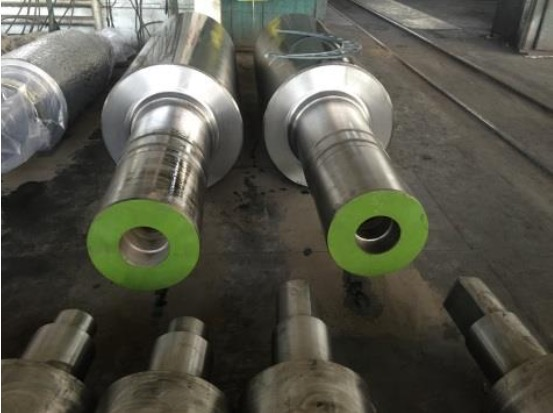
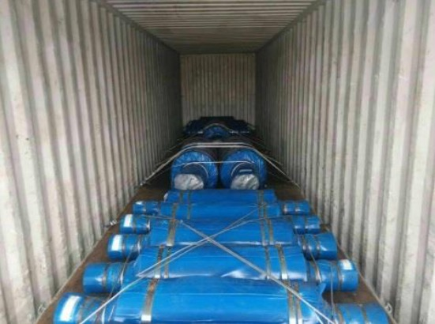
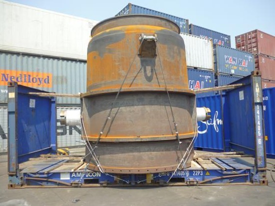
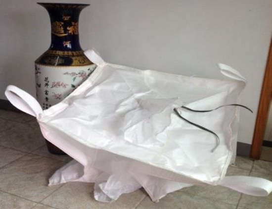
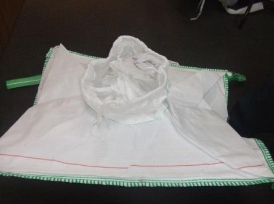

## Catalog

### Refractory

#### Casting channel

|  |  |

#### Alumina bricks

|  |  |

#### MgO bricks

|  |  |

### Casting part

#### Ingot mould and plate

|  |  |

#### Slag pot

|  |  |

#### Furnace tray

|  |  |

### Graphite and carbon products

#### Graphite electrode

|  |  |

#### Graphite crucible

|  |  |

#### Carbon and graphite blocks

|  |  |

### Copper parts

#### Oxygen lance

|  |  |

#### Tuyere

|  |  |

### Roller

|  |  |

### Metallurgical equipment

#### Ladle

|  |  |

### Packing

#### Big bag

|  |  |

### Forged parts, Titanium parts, Welding parts

### Chemicals

Ammonium sulfite, Ammonium nitrate, Ammonium bisulfite, Ammonium dimolybdate, Soda ash, Potassium dichromate, Calcium carbide

### Matières premières (Raw materials)

APT Ammonium paratungstate, YTO (Tungsten trioxide), Calcium tungstate from Catalyst processing, Ferrovanadium, Ferromolybdenum, FeSi75
