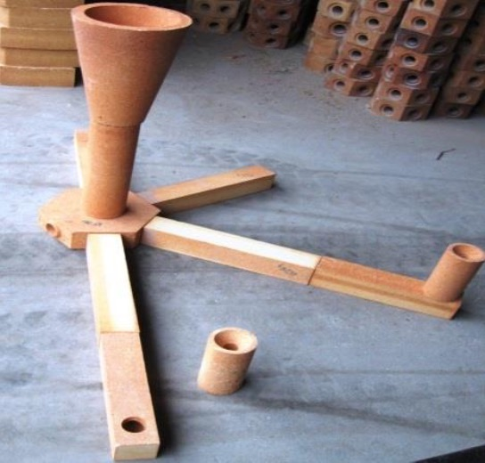
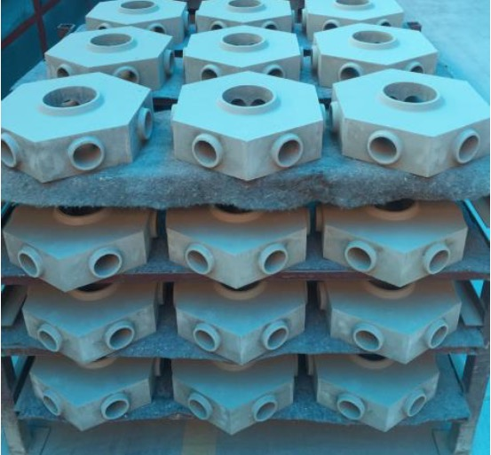
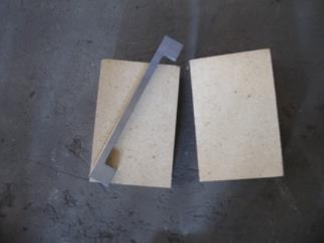
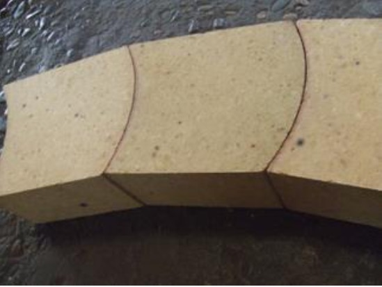
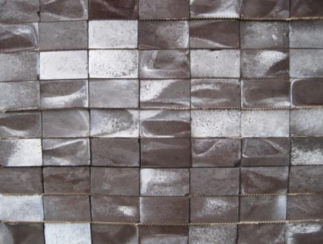
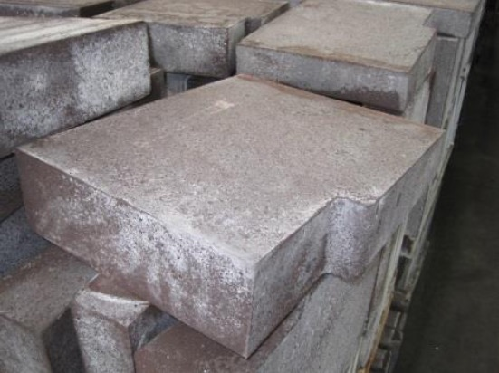

## Catalogue

### Refractory / Réfractaire

#### Casting channel / Canaux sources

|  |  |

#### Alumina brick / Brique alumineux

|  |  |

#### MgO brick / Brique magnésie

|  |  |

### Casting part / Pièce de fonderie

#### Ingot mould and plate / Lingotière et plaque

#### Slag pot / Cuvier et tundish

#### Furnace tray / Grille de four

### Graphite and carbon product / Produit graphite et carbone

#### Graphite electrode / Electrode graphite

#### Graphite crucible / Creuset

#### Carbon and graphite block / Bloc de carbone et graphite

### Copper part / Pièce de cuivre

#### Oxygen lance / Nez de lance à oxygène

#### Tuyere / Tuyère

### Roller / Cylindre laminoir

### Packing / Emballage

#### Big bag

### Forged parts / Pièces forgées

### Titanium parts / Pièces en titane

### Welding parts / Pièces mécano-soudées

### Chemicals / Produits chimiques

Ammonium sulfite / Sulfite d'ammonium
Ammonium nitrate / Nitrate d'ammonium
Ammonium bisulfite/ Bisulfite d'ammonium
Ammonium dimolybdate / Dimolybdate d'ammonium
Soda ash / Carbonate de sodium
Potassium dichromate / Bichromate de potassium
Calcium carbide / Carbure de calcium

### Metallurgical equipment / Equipements métallurgiques

#### Ladle / Poche de coulée et transfert

### Raw material / Matière première

APT Ammonium paratungstate
YTO / Tungsten trioxide
Calcium tungstate from Catalyst processing / CaW de catalyseur Ferrotungsten
Ferrovanadium
Ferromolybdenum
FeSi75
