## Catalogue

### Réfractaires (Refractory)

#### Canaux sources (Casting channel)

|  |  |

#### Briques alumineux (Alumina bricks)

|  |  |

#### Briques magnésie (MgO bricks)

|  |  |

### Pièces de fonderie (Casting part)

#### Lingotière et plaque (Ingot mould and plate)

| 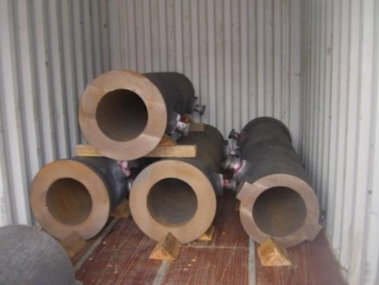 | 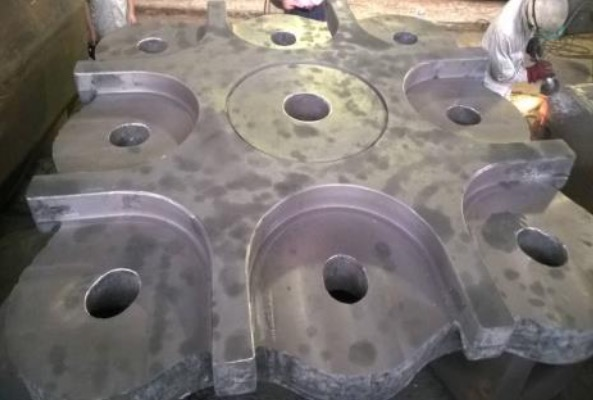 |

#### Cuvier et tundish (Slag pot)

| 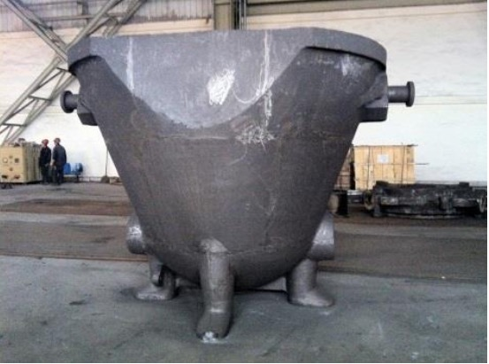 | 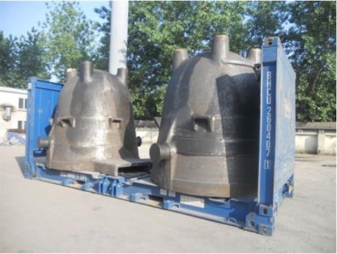 |

#### Grille de four (Furnace tray)

| 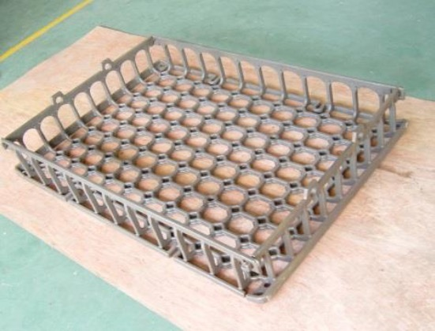 | 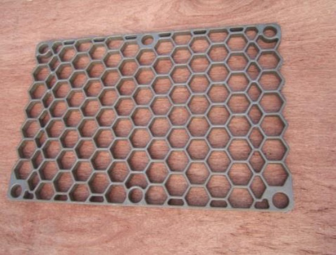 |

### Produits graphite et carbone (Graphite and carbon products)

#### Electrode graphite (Graphite electrode)

| 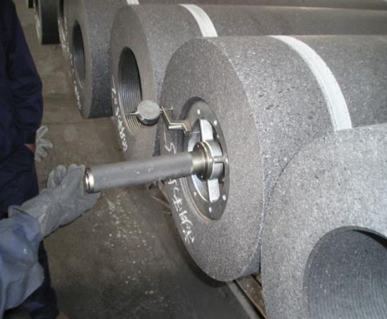 | 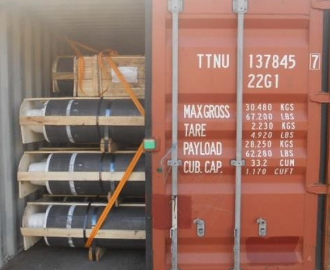 |

#### Creuset (Graphite crucible)

| 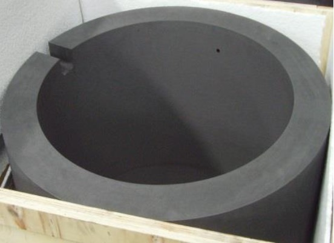 |  |

#### Blocs de carbone et graphite (Carbon and graphite blocks)

|  |  |

### Pièces de cuivre (Copper parts)

#### Nez de lance à oxygène (Oxygen lance)

| 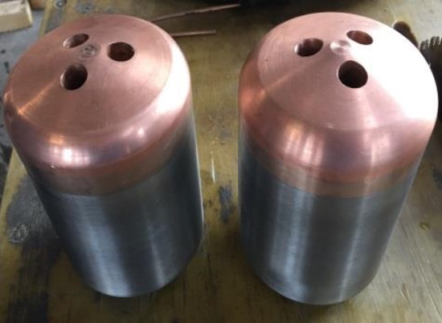 |  |

#### Tuyère (Tuyere)

| 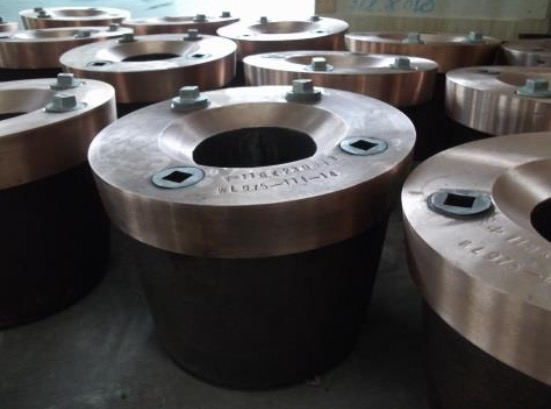 |  |

### Cylindre laminoir (Roller)

### Emballage (Packing)

#### Big bag

### Forged parts / Pièces forgées

### Titanium parts / Pièces en titane

### Welding parts / Pièces mécano-soudées

### Chemicals / Produits chimiques

#### Ammonium sulfite / Sulfite d'ammonium

#### Ammonium nitrate / Nitrate d'ammonium

#### Ammonium bisulfite/ Bisulfite d'ammonium

#### Ammonium dimolybdate / Dimolybdate d'ammonium

#### Soda ash / Carbonate de sodium

#### Potassium dichromate / Bichromate de potassium

#### Calcium carbide / Carbure de calcium

### Equipements métallurgiques (Metallurgical equipment)

#### Poche de coulée et transfert (Ladle)

### Matières premières (Raw materials)

#### APT Ammonium paratungstate

#### YTO / Tungsten trioxide

#### Calcium tungstate from Catalyst processing / CaW de catalyseur Ferrotungsten

#### Ferrovanadium

#### Ferromolybdenum

#### FeSi75
